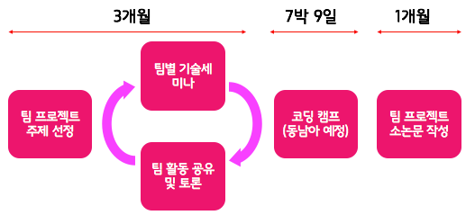
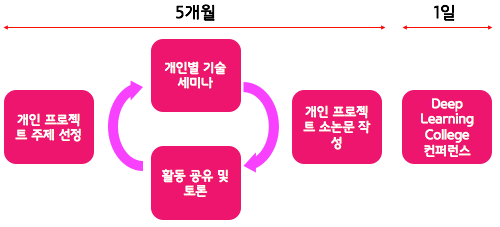
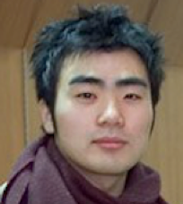
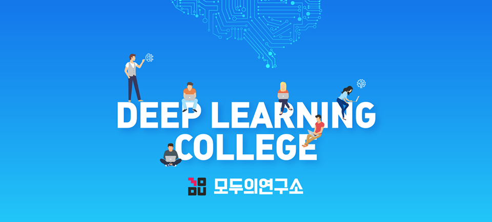

# Deep Learning College (DLC) Lectures

안녕하세요. DLC (Deep Learning College) 강좌를 위한 공간 입니다.

[TOC]

## 3개월 기초교육 강좌 스케쥴 

| 주차                      | 월요일              | 화요일                                  | 목요일                       |
| :---------------------- | ---------------- | :----------------------------------- | :------------------------ |
| 1주차  (1월 9,11일)         | -                | 기초필수 : Tool 사용법                      | 전공필수 : Deep Learning의 이해  |
| 2주차  (1월 15, 16, 18일)   | 기초선택 : 파이썬과 머신러닝 | 기초선택 :  Mathematics in Deep Learning | 전공필수 : Deep Learning의 이해  |
| 3주차  (1월 22, 23, 25일)   | 기초선택 : 파이썬과 머신러닝 | 기초선택 :  Mathematics in Deep Learning | 기초필수 : Tool 사용법           |
| 4주차  (1월 29, 30, 2월 1일) | 기초선택 : 파이썬과 머신러닝 | 기초선택 :  Mathematics in Deep Learning | 전공필수 : Deep Learning의 이해  |
| 5주차  (2월 5, 6, 8일)      | 기초선택 : 파이썬과 머신러닝 | 기초선택 :  Mathematics in Deep Learning | 전공필수 : Deep Learning의 이해  |
| 6주차  (2월 13, 15일)       | -                | 기초필수 : Tool 사용법                      | 기초필수 : Tool 사용법           |
| 7주차  (2월 19, 20, 22일)   | 기초선택 : 파이썬과 머신러닝 | 기초선택 :  Mathematics in Deep Learning | 전공필수 : Deep Learning의 이해  |
| 8주차  (2월 26, 27, 3월 1일) | 기초선택 : 파이썬과 머신러닝 | 기초선택 :  Mathematics in Deep Learning | 전공필수 : Deep Learning의 이해  |
| 9주차  (3월 6, 8일)         | -                | 전공선택  A/B  : (영상처리, 강화학습)            | 전공선택  A/B  : (영상처리, 강화학습) |
| 10주차  (3월 13, 15일)      | -                | 전공선택  A/B  : (영상처리, 강화학습)            | 전공선택  A/B  : (영상처리, 강화학습) |
| 11주차  (3월 20, 22일)      | -                | 전공선택  A/B  : (영상처리, 강화학습)            | 전공선택  A/B  : (영상처리, 강화학습) |
| 12주차  (3월 27, 29일)      | -                | 전공선택  A/B  : (영상처리, 강화학습)            | 전공선택  A/B  : (영상처리, 강화학습) |

## DLC 교육과정

- 1단계인 3개월 **기초교육 강좌**가 완료되면 2단계인 **연구프로젝트** 단계로 들어갑니다.
- 2단계 연구프로젝트 단계는 **팀 프로젝트**와 **개인 프로젝트**로 나뉘어 집니다.
  - **팀 프로젝트 단계 (4개월)** : 팀별 주제를 선정하고 팀 프로젝트를 수행하며 최종적으로 소논문을 작성합니다.
    - 주 1회 오프라인 모임을 갖습니다.

- **개인 프로젝트 단계 (5개월)** : 개인 프로젝트 주제를 선정 한 후 프로젝트 관련 소논문을 작성합니다.
  - 주 1회 오프라인 모임을 갖습니다.

## 3개월 기초교육 강사진 

| 강좌명      | 강사소개                                     | 사진                                       |
| -------- | ---------------------------------------- | ---------------------------------------- |
| 딥러닝 수학   | - **이주희**  - 현) 이화여자 대학교 수리과학연구소 연구교수  - 모두의연구소 *IoT 연구실* 멤버  - 모두의연구소 *제멋대로 딥러닝* 멤버 |                                          |
| 파이썬&머신러닝 | - **조용래**   - 현) 넥슨 데이터 분석가  - 패스트캠퍼스 데이터 사이언스 스쿨 머신러닝 강의   - 2017 Google Machine Learning Challenge 3위  - SM 주최 "음악, 인공지능을 만나다" 우승  - 모두의 연구소 DeepLAB 자연어처리반 멤버 |                                          |
| 딥러닝의 이해  | - **박은수**  - 현) 모두의연구소 Research Director  - "Convolutional Neural Network" 강의 (인하대학교)  - "Python Basics" 강의 (인하대학교)  - "실전! Keras를 이용한 딥러닝 활용" 강의 (삼성멀티캠퍼스) |  |
| 딥러닝 강화학습 | - **이웅원**  - 현) 제이마플 선임 연구원  - 현) RLCode 리더  - 모두의연구소 *DCULab.* 랩장  - 모두의연구소 *강화학습 스터디* 연구원  - "파이썬과 케라스로 배우는 강화학습" 저자  - "Keras로 시작하는 강화학습 입문" 강의 (패스트캠퍼스)  - **양혁렬**  - 한양대학교 컴퓨터 공학, 경영학 전공  - 서울대학교 음악 오디오 연구실 연구원 참여  - RLCode 공동운영  - "파이썬과 케라스로 배우는 강화학습" 공동저자  - 넷마블 몬스터 "딥러닝 기초부터 강화학습 베이스라인까지" 초청강연 진행 |                                          |
| 딥러닝 영상처리 | - **박은수**  - 딥러닝의 이해 강사로 이력이 동일 합니다. |                                          |
| *강좌 도우미* | - **이일구**  - 현) 모두의연구소 Research Scientist |  |                                         |

# 

